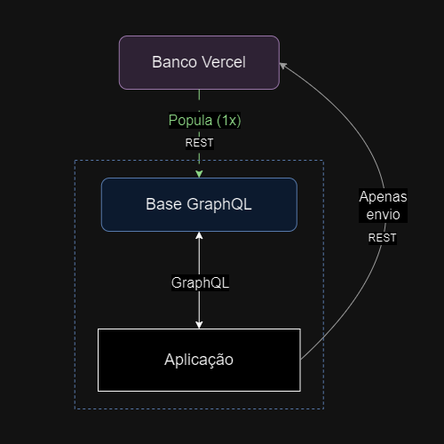

### Adaptações e melhorias feitas baseadas no feedback recebido

Pontos citados na revisão do código do projeto:
- Não utilização de GraphQL
- Componentização
- Comentários não ideais
- Código com exemplo "Hello World"
- Utilização não necessária de client components na versão web
- Utilização desnecessária de "use client" na versão mobile
- Indentação e organização
- Fluxo confuso de confirmar conclusão de tarefas

Seguem abaixo as medidas tomadas para cada um dos pontos e esclarecimentos adicionais.

---

##### Não utilização de GraphQL:

Foi trazido à tona no code review a limitada utilização da linguagem de consultas GraphQL em relação às funcionalidades mais abrangentes do app, tendo na primeira versão sido utilizada apenas para uma de suas features. Buscando atender os requerimentos, a estrutura geral do projeto foi adaptada. 

A imagem acima busca traduzir de forma prática a nova lógica implementada, que buscou manter o funcionamento anterior da aplicação porém atender a utilização abrangente do GraphQL para as diversas funcionalidades de kanban e de relatórios da aplicação. Temos que:

- A aplicação é populada pelo banco serverless uma única vez assim que o usuário entra em sua área de trabalho
- Armazena as informações em uma base local, preparada para ser acessada e modificada por métodos (queries e mutations) GraphQL
- A cada atualização e modificação dos dados dentro da aplicação, a base local GraphQL é modificada por meio de suas funções específicas, em formato adequado
  - Além disso, as requisições REST de atualização do banco foram mantidas, não por necessidade de funcionamento, mas para manter a lógica de retenção de dados anterior. Essas poderiam ser removidas sem maiores problemas no uso imediato.

Arquivos importantes para a implementação e visualização da lógica implementada:
- `graphQl_functions.ts`
- `schemaWrapper.tsx`
- `SchemaVisualizer.tsx`

---
##### Componentização:

Foram feitos esforços para componentizar componentes para promover uma maior simplicidade, coesão e reutilização de componentes e subcomponentes no código.

---
##### Comentários não ideais

Foram observados, adaptados de forma a terem explicações mais formais, e adicionados ou removidos com mais cuidado. Em relação ao comentário original citado, ele se referia a uma possível limitação do DATATYPE Int nos bancos, o que poderia ser um problema pela utilização da lógica de TIMESTAMP como ID para as rotas do banco provisório. Novos comentários foram adicionados para esclarecer tal situação.

---
##### Código com exemplo "Hello World"

Se tratava de um código "vestigial" de uma etapa de testes com o GraphQL, antes da lógica de mock e base local, quando ainda estava cogitando levantar um real servidor com o Apollo. Este e outros arquivos não completos ou que não deveriam estar no projeto foram removidos.

---
##### Utilização não necessária de client components na versão web

Foram observados componentes que poderiam ter tido sua definição de 'client component' feita de forma equivocada. Como exemplo, o `App.tsx`, que foi prontamente subdividido e adaptado para mantê-lo como 'server component', repassando as funções de blur antes do mount para componentes individuais. Também, outros componentes como `GithubHandle.tsx` e `Card.tsx` puderam ser transformados/mantidos para não apresentarem a necessidade do "use client".

---
##### Utilização desnecessária de "use client" na versão mobile

Na hora da adaptação do código da aplicação web para a aplicação mobile, acabaram sendo mantidos os marcadores de componentes de cliente "use client". Foram prontamente removidos.

---
##### Indentação e organização

A organização de arquivos individuais, comentários, indentação e organização de pastas no projeto foram revisadas, para tornar toda a estrutura mais organizada.

---
##### Fluxo confuso de confirmar conclusão de tarefas

O fluxo foi simplificado. Não há mais necessidade de pressionar e segura em um botão. Ao clicar no botão de `Confirmar Tarefas`, um alerta explicando a funcionalidade aparece e dando a possibilidade de confirmar ou não a ação.

---

