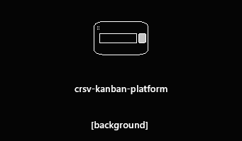
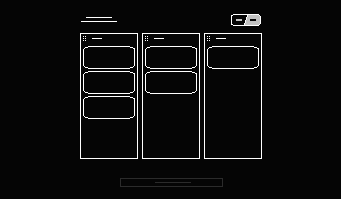
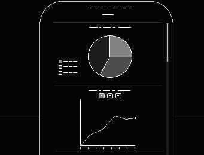
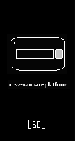
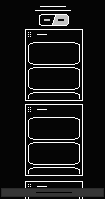
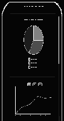

## Main Page
- Styling should be similar to ShadcnUI by default
- Responsive

---

### Constant Top Elements
- Github handle
- Theme switch

---

### Guest
- Landing page info / background
- Login (set username) option

---

### User

#### Main Page

- ##### Kanban task area (middle)
    - Columns (In progress, ToDo, Done)
    - Filters (tag, color)
    - Tasks
        - Modal task editing 
- ##### Pull-up Dahboard (info/graphics)
    - Pie-Chart with current task status (P, T, D)
    - Linear graph with amount of tasks done over time

---

### Lo-Fi Sketch views

  

  Web
  

  
##### Guest

##### Main

##### Dashboard

  

  Mobile
  

  
##### Guest

##### Main

##### Dashboard

